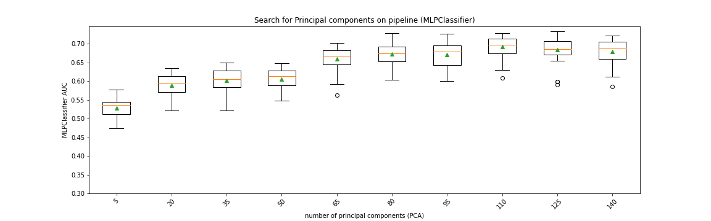
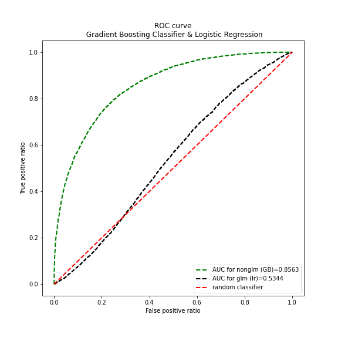

# A two class classification for a data with 100 features


This is a data sciecne exercise project. The project has all sort of challenges inclduing dealing with missed values, encoding, transforming, skewness, etc.

My initial recap for numerical and catogirical features are as follow:

---
## Analysis Recap for Categorical features

* x3 is a nominal categorical feature (needs OneHotEncoder transformer) and custom function edit is needed
* x7 column: the % sign should be cleaned from strings and I need to change the dtype and introduce it as a numeric feature.
* x19 column: the % sign should be cleaned from strings and I need to change the dtype and introduce it as a numeric feature.
* x24 column: is a nominal category and needs to be transformed using One Hot Encoding
* x31 column: is a nominal category and needs to be transformed using One Hot Encoding
* x33 column: is a nominal category and needs to be transformed using One Hot Encoding
* x39 should be dropped the column 
* x60 is nominal and OneHotEncoder should be used to transfer this column
* x65 is nominal and OneHotEncoder should be used to transfer this column
* x77 is nominal and OneHotEncoder should be used to transfer this column
* x93 is nominal and OneHotEncoder should be used to transfer this column
* X99 should be dropped - it has just one category. 
* The x24, x33, and x77 columns NaN values need to be replaced by their mode.


## Analysis Recap for Numerical features


- Column 'x30', 'x44', 'x57' have more than 50% nan and should be droped
- Three features inside the numeric df need to be transformed using One Hot Encoding. These are features with 0-1 values and should be treated like category features. These are 0-1 features and should be treated like category features. columns are x59 and x79 and x98
- I may use Isolation Forest or LOF for outlier detection. I will check the AUC to see the differences.
- High score numerical features are as follow:
```['x16', 'x18', 'x28', 'x32', 'x35', 'x40', 'x47', 'x52', 'x57', 'x62', 'x68', 'x70', 'x75', 'x78', 'x81', 'x88', 'x89', 'x95', 'x96']```
- With n_components=12, I get 0.62 AUC, and as it is seen 12 principal components have 62٪ of variance. I may apply PCA if I found not using it computationally time expensive.


Outliers for first 7 numerical features are seen below.
 <p align="center">
  
</p>


# EDA 

 <p align="left">
  
</p>


# Principal Component Analysis (PCA)

Principal Component Analysis (PCA) with 10 fold cross-validation is seen below.

<p align="left">
  
</p>

# Preprocessor pipeline

```python
{'pipeline-1': Pipeline(steps=[('custom_edit_x3_tf',
                  FunctionTransformer(func=<function custom_edit_x3 at 0x7fc1c7d2b7b8>)),
                 ('imp', SimpleImputer(strategy='most_frequent')),
                 ('ohe', OneHotEncoder())]),
 'pipeline-2': Pipeline(steps=[('imp', SimpleImputer(strategy='most_frequent')),
                 ('ohe', OneHotEncoder())]),
 'pipeline-3': Pipeline(steps=[('imp_ohe', SimpleImputer(strategy='most_frequent')),
                 ('ohe', OneHotEncoder())]),
 'pipeline-4': Pipeline(steps=[('imp', SimpleImputer()), ('scaler', StandardScaler()),
                 ('p_tf', PowerTransformer()),
                 ('selector', VarianceThreshold(threshold=0.1))]),
 'functiontransformer-1': FunctionTransformer(func=<function custom_edit_x7 at 0x7fc1c7d2ba60>),
 'functiontransformer-2': FunctionTransformer(func=<function custom_edit_x19 at 0x7fc1c7ccee18>),
 'pipeline-5': Pipeline(steps=[('imp', SimpleImputer()), ('scaler', StandardScaler()),
                 ('p_tf', PowerTransformer()),
                 ('selector', VarianceThreshold(threshold=0.1))]),
 'remainder': 'drop'}
```


## Outcome


 <p align="left">
  
</p>


